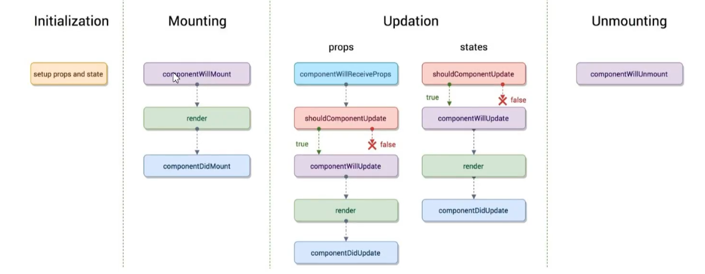
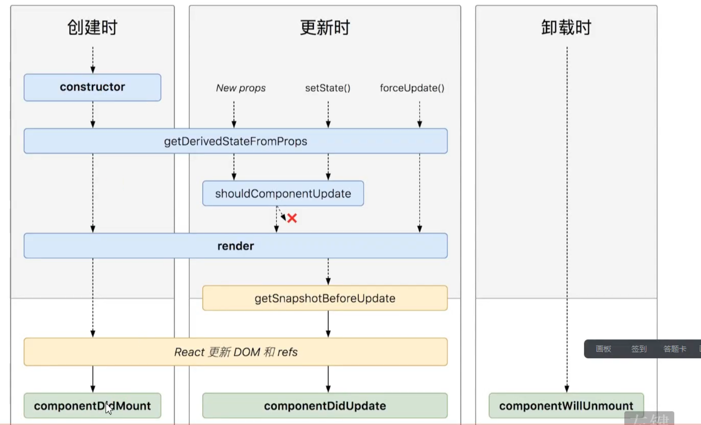

### React

##### 组件化开发

-   可组合： 一个组件可以和其它的组件一起使用或者可以直接嵌套在另一个组件的内部
-   可重用： 每个组件都是具有独立功能的，他可以被使用在多个场景中
-   可维护： 每个小组件仅仅包含自身的逻辑，更容易被理解和维护

##### 状态

setState 两功能

-   1、修改状态
-   2、重新 render

state 更新可能是异步的

-   处于性能考虑，React 可能会把多个 setState() 调用合并成一个调用
-   因为 this.props 和 this.state 可能会异步更吸毒男，所以不要依赖他们的值来更新下一个状态
-   可以让 setState() 接收一个函数而不是一个对象。 这个函数用上一个 state 作为第一个参数

state 的更新会被合并

-   当你调用 setSate() 的时候，React 会把你提供的对象合并到当前的 state

当调用 setState 的时候，状态并没有改变，而是放入一个队列中

```javascript
this.setState(state => ({ number: state.number + 1 }))

let state = { number: 0 }
let callbacks = []
callbacks.push([state => ({ number: state.number + 1 }), () => console.log(state)])
callbacks.push([state => ({ number: state.number + 1 }), () => console.log(state)])
callbacks.push([state => ({ number: state.number + 1 }), () => console.log(state)])
callbacks.push([state => ({ number: state.number + 1 }), () => console.log(state)])
let v
let fns = []
while ((v = callbacks.shift())) {
    let [cb, fn] = v
    state = cb(state)
    fns.push(fn)
}
console.log(state)
fns.forEach(fn => fn())
```

##### 解决 this 指针的三种方法

-   this.add.bind(this) 把 add 方法里面的 this 指针绑定为组件实例
-   () => this.add() 匿名函数
-   在定义的时候 add = () => {} 即可以直接使用 this.add 给类的实例增加一个 add 的属性，而这个属性里的 this 绑定位组件的实例

replaceState 15.5 之前有

this.forceUpdate() 强制刷新页面

##### 纯 函数有两个特点

-   1、不能改变入参
-   2、不能影响作用域之外的变量

##### 受控组件 非受控组件 以及 ref

1、ref= 字符串 2、ref = 函数

ref 可以引用类组件，不能引用函数组件
函数组件一渲染就销毁了没有实例，所以拿不到

```javascript
// 使用
;<TextInput2 ref1={this.textInput} />

function TextInput2(props, ref1) {
    return <input ref={ref1} />
}
React.forwardRef(TextInput2)

// 实现 forwardRef
function forwardRef(funComponent) {
    return function (props) {
        // ref= {current: null}
        return funComponent(props, props.ref1)
    }
}
```

```javascript
// 1=====>
sum() {
    console.log(this.refs.numA.value)
}
<input ref="numA" />+ <input ref="numB" /> <button onClick={this.sum}>=</button><input ref="result" />
// 2=====>
sum2() {
    console.log(this.numA.value)
}
<input ref={inst => this.numA = inst} />


//3 =====>
sum3() {
    console.log(this.numA.current.value)
}
constructor(props) {
    super(props)
    this.numA = React.createRef()
}
<input ref={this.numA} />
```

createRef 实现

```javascript
function createRef() {
    return { current: null }
}
```

受控组件和非受控组件

非受控组件指的是 DOM 元素的值存在 DOM 元素内部，不受 react 控制
受控组件只的 DOM 元素的值受 React 状态控制

defaultValue 赋默认值

单向数据流

##### setState 深入理解

this.setState(newState) -> newState 存入 pending 队列 -> (Y) 保存组件于 dirtyComponents中
                                                     -> (N) 遍历所有的 dirtyComponents中 调用updateComponent  更新 pending state or props


setState

```javascript
class Component {
    constructor(props) {
        this.props = props
    }
    createDOMFromDOMString(domString) {
        let div = document.createElement('div');
        div.innerHTML = domString;
        return div.children[0];
    }

    setState(partialState) {
        this.state = Object.assign(this.state, partialState)
        let oldElement = this.domElement;
        let newElement = this.render();
        oldElement.parentElement.replaceChild(newElement, oldElement)
    }

    renderElement() {
        let htmlString = this.render();
        this.domElement = this.createDOMFromDOMString(htmlString)
        // 将Counter的组件实例放在component上
        this.domElement.component = this
        return this.domElement;
    }

    mount(container) {
        container.appendChild(this.renderElement())
    }
}

window.trigger = function(event, method,  ...others) {
    event.target.component[method].call(event.target.component, event, ...others)
}
class Counter extends Component {
    constructor(props) {
        super(props)
        this.state = {number: 0}
    }

    add() {
        this.setState({
            number: this.state.number + 1;
        })
    }

    render() {
        return `<button onclick-="trigger(event, add)">

            ${this.props.name}: ${this.state.number}
        </button>
        `
    }
}

```
##### 合成时间
react 所有事件委托给全局的 document
- 提供统一的API 抹平各大浏览器差异
- 所有时间绑定在React root Element进行事件委托

###### Transaction 事务

-   一个所谓的 Transaction 就是将需要执行的 method 使用 wrapper 封装起来， 在通过 Transaction 提供的 perform 方法执行
-   而在 perform 之前，先执行所有 wrapper 中的 initialize 方法；perform 完成之后再执行所有的 close 方法
-   一组 initialize 及 close 方法称为一个 wrapper

##### 生命周期

旧版
| Initialization | Mounting |Updation |Unmounting |
| ---- | ---- | ---- | ---- |
|setup props and state | componentWillMount| props   state | componentWillUnmount|
|                      | render            | compomemtWillReceiveProps shouldComponentUpdate | |
|                      | componentDidMount| shouldComponentUpdate ComponentUpdate | |
|            “          |                  | ComponentUpdate render| |
|                      |                  | render componentDidUpdate| |
|                      |                  | componentDidUpdate        |  |




shouldComponentUpdate(nextProps, nextState) {

}

react 16 采用fiber架构



阶段
- render阶段纯净且没有副作用，可能会被React暂停， 中止或者重新启动
- “Pre-commit 阶段” 可以读取DOM
- “Commit阶段”可以使用DOM， 运行副作用， 安排更新

```javascript
//根据新的属性对象派生状态对象, 新的属性对象 和旧的状态对象
getDerivedStateFromProps(nextProps, prevState) {
    
}

getSnapshotBeforeUpdate() {
    return ’一个返回值给componentDidUpdate‘
}

componentDidUpdate(nextProps, prevState, 接收快照返回值参数) {

}
```

##### context
在某些场景下，在整个组件树中传递数据，但确不想每一层传递属性， 可以在REact中使用强大的从而对系统API解决


##### 类型检查
- 要在组件的props上进行类型检查，只需要配置特定的propTypes属性
- 可以通过配置特定的defaultProps属性类定义props的默认值

```javascript
import PropTypes from 'prop-types'

MyComponent.propTypes = {
    optionalArray: PropTypes.array
}
```

#### hooks

memo 性能优化：
- 当react中一个组件进行更新时， 它的所有子组件都会进行重新渲染，即便子组件的props并未发生任何改变
React.memo对子组件默认使用浅比较对你前后两次props的变更，，若未发生变更则不会重新渲染，因此提高了性能。

userMemo useCallback 通过对传入的依赖（浅比较）来确定返回新的值还是以前的值


##### PureComponent memo

PureComponent  重写了 shouldComponentUpdate  在内部进行浅比较
那么对于函数式组件实现类似的pureComponent的使用memo

memo类似代码的方式创造一个类组件返回， 该类组件继承pureComponent 
在内部return 传入的函数式组件 FunctionComponent(this.props) or <FunctionComponent {...this.props} />

##### 高阶组件

- 高阶组件就是一个函数，传给他一个组件返回新组件， 实现组件间的代码复用

高阶函数： 把函数当参数，返回新的函数

JS中的函数要比一般语言中高级一些，其它语言Java等函数不能作为参数进行传递


洋葱模型